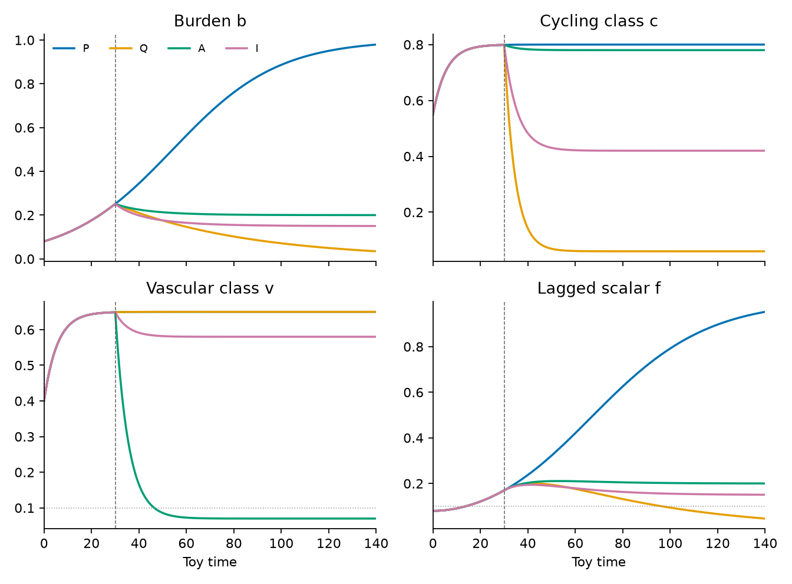
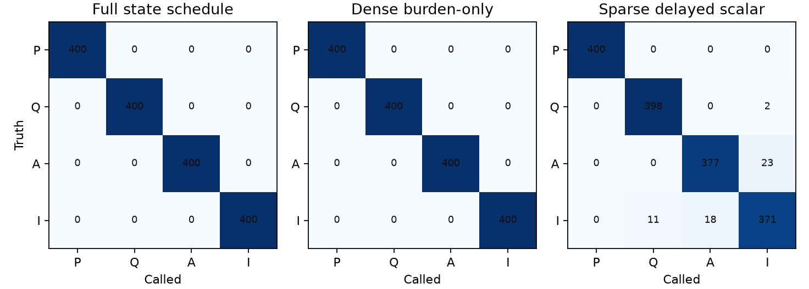
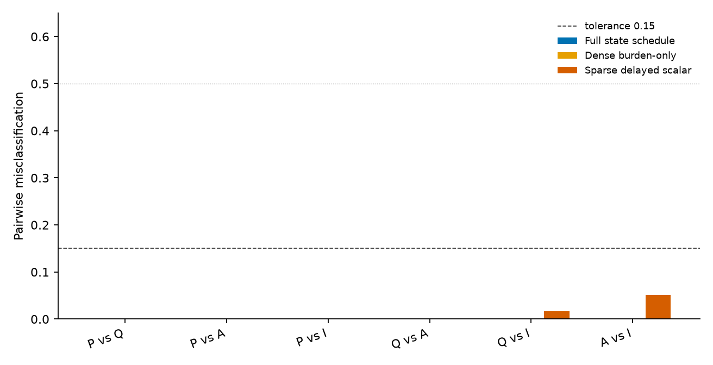
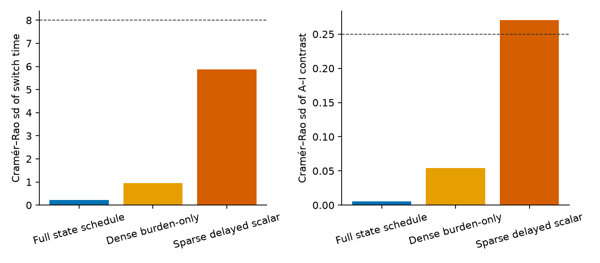
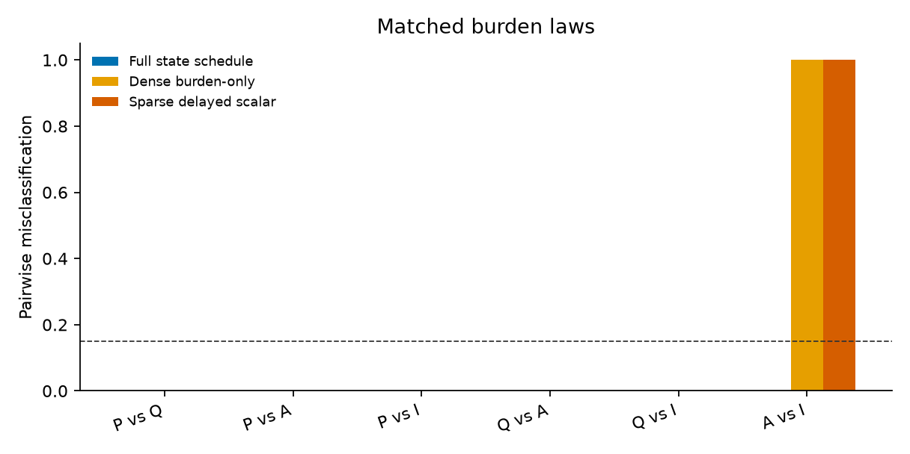
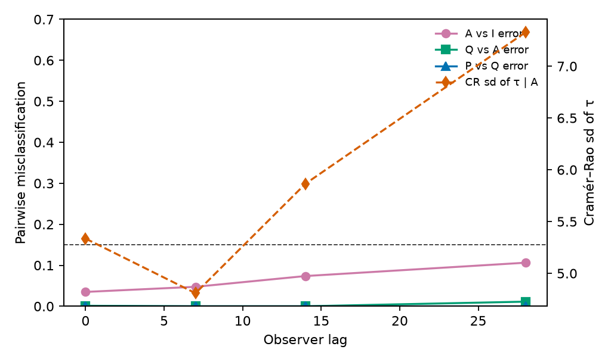

# Hybrid occult mode switches under sparse delayed liquid-biopsy-style partial observers

**Thesis #20. Computational research thesis**  
**Author:** Kelechi Emeka Ogbonna  
**Correspondence:** kelechiogbonna300@gmail.com · https://github.com/cloudynirvana/thesis-20-occult-modes-partial-liquid-biopsy-observer  
**Date:** 21 September 2026  
**Format:** B.Sc. project chapters (Nile University style), written as a computational methods manuscript  
**Depends on:** Thesis #4 (hybrid occult modes) and Thesis #9 (practical identifiability under partial maps)  
**Status:** Seeded discrimination of named mode switches on a declared toy. Not a fitted hybrid model. Not a ctDNA assay.  
**Citation style:** numbered Vancouver. A `doi:` field appears only where Crossref returned the record.  
**DOI:** none for this document. Do not invent one.

---

## Title page

**HYBRID OCCULT MODE SWITCHES UNDER SPARSE DELAYED LIQUID-BIOPSY-STYLE PARTIAL OBSERVERS**

BY

**KELECHI EMEKA OGBONNA**

A COMPUTATIONAL RESEARCH THESIS  
(IN-SILICO OBSERVER DESIGN ON A HYBRID TOY)

SUBMITTED AS A CITEABLE MANUSCRIPT FOR JOURNAL / THESIS HANDOFF

PROJECT CONFLUENCE  
INDEPENDENT COMPUTATIONAL RESEARCH

SUPERVISOR: not appointed for this deposit

SEPTEMBER 2026

---

## Declaration

I, Kelechi Emeka Ogbonna, declare that this computational research thesis was carried out by me. The trajectories, misclassification counts, Fisher numbers, and profiles reported here were produced by `sim/hybrid_observer_toy.py` at seed 20260921. They are not wet-lab measurements and not patient outcomes. No DOI, ORCID, or journal acceptance was invented for this document.

_________________________     _______________________  
Kelechi Emeka Ogbonna         Date

---

## Abstract

Which hybrid occult mode switches remain practically identifiable when the observation map is a sparse, delayed liquid-biopsy-style partial observer rather than a full state schedule?

Thesis #4 named the pauses. Cellular quiescence, angiogenic pause, and immune-held latency are discrete modes beside a proliferative mode, and occult is a predicate on a detection floor together with one of those pauses. That specification assumes the switching observables can be read. Thesis #9 asked a different question, about rank and profile of a shared metabolic ODE under multi-channel snapshots. It did not ask which hybrid switch a sparse scalar can still tell from another.

The object here is that missing comparison, on one three-coordinate toy. The coordinates are a burden, a cycling class, and a vascular class. The flows are declared. They are not estimated, and they are not the rates of Thesis #9. From a common proliferative path, a switch at toy time 30 either continues proliferation, enters quiescence, enters an angiogenic pause, or enters immune-held latency. Three maps are scored on the same paths. The full schedule reads all three coordinates every 2 time units. A dense burden map reads only the burden on that same clock. A sparse delayed scalar reads a linear lag of the burden every 20 time units, with Gaussian noise and a left floor at 0.10. The scalar is liquid-biopsy-style only as a pattern: one channel, a lag, infrequent times, a threshold. It is not an assay.

On 400 draws a class, with the switch time profiled on a grid, the full schedule and the dense burden map misclassify none of the six pairs. The sparse scalar also separates continued proliferation from each pause (0 of 800), and quiescence from the angiogenic pause (0 of 800). Quiescence versus immune-held latency fails in 13 of 800 (rate 0.016). Angiogenic pause versus immune-held latency, whose burden balances differ by 0.05, fails in 41 of 800 (rate 0.051). Both rates sit under the predeclared tolerance 0.15, so the script calls them still discriminable. The local Cramér–Rao standard deviation of the continuous contrast between those two pauses is 0.270 on the scalar, which fails the predeclared tolerance 0.25. The same contrast has standard deviation 0.00556 on the full schedule.

A second arm gives the two pauses the same burden law and leaves the cycling and vascular targets different. The full schedule still separates them (0 of 800). The dense burden map and the scalar return Fisher information 0 for the contrast. On the burden map all 800 pairwise comparisons are unresolved ties. On the scalar, 799 are unresolved ties and the remaining trial is not a correct call. Ties are scored as failures to discriminate, so the pairwise rate is 1.

Switch time is a different object from mode identity. If the post-switch mode is still proliferative, the trajectory does not depend on the switch time, and the Fisher information for that time is 0 on every map. For a true angiogenic switch, the local standard deviation is 0.214 on the full schedule, 0.960 on the dense burden map, and 5.866 on the scalar. The noise-free profile on the scalar nevertheless stays inside the likelihood threshold from grid time 12 to 40, a half-width of 18. The local quadratic and the profile disagree. The script's call uses the local standard deviation. The profile is the wider fact.

Research only. Not a medical device, not a minimal-residual-disease call, and not a cure.

---

## Keywords

hybrid modes; practical identifiability; partial observation; mode discrimination; switching time; liquid-biopsy-style observer; Fisher information; profile likelihood; toy model; research only

---

## Table of Contents

DECLARATION  
ABSTRACT  
Table of Contents  
List of tables and figures  

CHAPTER ONE. INTRODUCTION  
1.1 Background to the study  
1.2 STATEMENT OF RESEARCH PROBLEM  
1.3 JUSTIFICATION OF STUDY  
1.4 AIM AND OBJECTIVES OF THE STUDY  
1.5 SIGNIFICANCE OF THE STUDY  
1.6 SCOPE OF THE STUDY  

CHAPTER TWO. LITERATURE REVIEW  
2.1 The pauses are already named  
2.2 A hybrid object, already specified  
2.3 Practical identifiability is a property of a map  
2.4 A scalar with a lag and a floor  
2.5 What this thesis does not borrow  

CHAPTER THREE. MATERIALS AND METHODS  
3.1 Design  
3.2 The toy, and the inherited mode names  
3.3 Three observation maps  
3.4 Likelihood, ties, and the two classification tasks  
3.5 Switch time and the pause contrast  
3.6 Matched burden laws, and a lag sweep  
3.7 What was not done  

CHAPTER FOUR. RESULTS  
4.1 Four paths from one proliferative segment  
4.2 The full schedule  
4.3 Dense burden, while the balances differ  
4.4 The sparse delayed scalar  
4.5 Switch time, local and along the profile  
4.6 The contrast between the two pauses  
4.7 The same burden law  
4.8 Lag  
4.9 Checks  

CHAPTER FIVE. DISCUSSION, CONCLUSION AND RECOMMENDATION  
5.1 Discussion  
5.2 Conclusion  
5.3 Recommendation  

REFERENCES  
DISCLAIMER  

---

## List of tables and figures

**Table 3-1.** Declared targets of the four modes.  
**Table 3-2.** Observation maps.  
**Table 3-3.** Predeclared tolerances.  
**Table 4-1.** State just before the switch, and at the horizon.  
**Table 4-2.** Pairwise misclassification on the primary toy, switch time profiled.  
**Table 4-3.** Local Fisher summaries for switch time and for the pause contrast.  
**Table 4-4.** Noise-free profile of switch time.  
**Table 4-5.** Matched burden laws.  
**Table 4-6.** Lag sweep on the sparse clock.  
**Table 4-7.** Script calls on the primary toy.

**Figure 4-1.** Burden, cycling class, vascular class, and lagged scalar.  
**Figure 4-2.** Four-way confusion, switch time profiled.  
**Figure 4-3.** Pairwise error on the primary toy.  
**Figure 4-4.** Cramér–Rao standard deviations.  
**Figure 4-5.** Lag sweep.  
**Figure 4-6.** Pairwise error when the two pauses share a burden law.

Figures are diagnostics from `sim/hybrid_observer_toy.py`. They are not measured time series.

---

# CHAPTER ONE

## 1.0 INTRODUCTION

### 1.1 Background to the study

Residual disease can be quiet for more than one reason. A disseminated cell can sit in a G0-like arrest. A small population can proliferate and die in place without recruiting vessels. Adaptive immunity can hold an occult lesion without clearing it [1–9]. Those are different pauses. They can look alike to an assay that only reports that something is below a floor [43,44].

Thesis #4 wrote the distinction as a hybrid object. The mode set is proliferative colonisation, cellular quiescence, angiogenic pause, immune-held latency, and an overt exit that this thesis does not open. Switching is guarded by observables: a cycling class, a vascular-recruitment class, an immune-equilibrium class, and a detection floor. Occult is the predicate that the burden sits below the floor and the mode is one of the three pauses. The thesis then stops. It does not fit parameters, and it does not integrate a vector field [14]. The guards are research syntax. They presume that the class signals are available to be read or refused. A missing cycling signal, in that specification, refuses the quiescence claim. It does not by itself say what a burden-only record can still decide.

Thesis #9 asked an identifiability question on a different object. A four-state metabolic ODE, five shared rates, and two observation schedules: a lactate/glucose ratio, and a four-channel snapshot with a loading. Rank and profile moved with the map. A time course restored a rank the snapshot did not have. Those ranks live in that repository. They are not repeated here, and the vector field of that study is not the vector field below [15]. What carries over is the narrower moral. Practical identifiability is a property of a named map, a noise model, and a finite grid. It is not a property of the equations alone [16–20].

Liquid biopsy supplies the pattern for a third map, and only the pattern. Circulating tumour DNA is discussed in the clinical literature as a sparse, delayed, and thresholded readout of shedding, with analytical limits that are not the same thing as a tumour measurement [21–29]. A mathematical shedding model has been used to relate fragment detection to tumour size [30]. Those papers are context for why an observer might be one channel, late, infrequent, and censored. Chapter Four does not estimate a shedding rate from any of them, and it does not report a sensitivity, a specificity, or a residual-disease call [31–33].

Hybrid and switched systems already have a language for a discrete location beside a continuous state [34–38]. Observability of a nonlinear state, and structural identifiability of a parameter, are older questions [16,39,40]. The calculation in this thesis is smaller than either theory. The modes are given. The flows are given. The unknown, when it is unknown, is which mode was entered, and when.

May's warning applies before any of those sentences is treated as biology. An equation borrowed from a neighbouring field still has to be the equation the prose describes [41]. Saltelli and colleagues make the same demand of any model that might be mistaken for a decision [42].

### 1.2 STATEMENT OF RESEARCH PROBLEM

Which hybrid occult mode switches remain practically identifiable when the observation map is a sparse, delayed liquid-biopsy-style partial observer rather than a full state schedule?

The working form is narrow. There are four post-switch modes, one of which is "no change of field." There are three maps, fixed in the script before the Monte Carlo is read as a result. There is a pairwise error tolerance of 0.15, a switch-time standard-deviation tolerance of 8 toy time units, and a tolerance of 0.25 on the standard deviation of a unit contrast between the angiogenic pause and the immune-held latency. The question is which pairs, and which of those two continuous parameters, meet the tolerances on which map.

A familiar way to miss the question is to refit a metabolic rate and call the exercise a mode study. Another is to treat a tie between two identical likelihoods as a confident wrong label. Ties are counted here as failures to resolve. A third miss is to quote only the local Fisher number when the profile along the same parameter is wide. Both are reported.

The answer is a property of this toy and these maps. It is not a statement about every hybrid model, and it is not a statement about a named assay [41].

### 1.3 JUSTIFICATION OF STUDY

Thesis #4 closes a modelling habit: occult is not an extra continuous coordinate, and it is not a dormancy coefficient stuffed into a parameter vector [14]. It leaves the observation question open, because the guards are written on class signals. A record that looks like a liquid biopsy does not carry those class signals. It carries something closer to a lagged, censored burden. Whether that is enough to tell the pauses apart is not answered by writing the mode table again.

Thesis #9 closes a different gap. It shows that a summary ratio, a loaded snapshot, and a time course need not share a null space, on one metabolic ODE [15]. The null space there is a ray of kinetic rates. The null space here, when it appears, is a pair of modes whose burden laws coincide. Copying either set of ranks into this manuscript would answer the wrong question.

The study is the comparison: same flows, three maps, pairwise error, a local information calculation, and a noise-free profile. A matched-burden arm is included so that a small gap in the burden balance is not quietly treated as the only case. If the gap is doing the work, removing it should remove the separation on every map that cannot see the other two coordinates.

The study is not justified as a device, a draw calendar, or a claim that any mode name is a treated cohort [42].

### 1.4 AIM AND OBJECTIVES OF THE STUDY

The aim is to determine which of the named switches on the toy in Chapter Three remain practically discriminable, and which continuous switch parameters remain locally informative, when the full state schedule is replaced by a dense burden map and by a sparse delayed scalar.

The objectives are:

1. Integrate the four declared flows from a shared proliferative segment and record the state the full schedule can see.
2. Classify mode on each map, with switch time known and with switch time profiled, and tabulate pairwise error against the tolerance 0.15.
3. Compute Fisher information for the switch time in each post-switch mode, and for a local contrast between the angiogenic and immune-held fields.
4. Place the noise-free profile of switch time beside the local standard deviation.
5. Repeat the classification after the two pauses are given the same burden law, and sweep the lag on the sparse clock.
6. Keep assay performance, dosing, and any reading of a toy call as a residual-disease determination outside the aim.

Non-aims. Re-deriving the mode table of Thesis #4. Recomputing the metabolic ranks of Thesis #9. Fitting the toy rates to a fragment time series. Choosing a clinical threshold.

### 1.5 SIGNIFICANCE OF THE STUDY

The useful product is a split that can fail in public. If the sparse scalar separates every pair that the full schedule separates, the worry about observation richness fails on this toy, for these noise levels. If it separates none of them, the mode table is doing no observational work under that map. Chapter Four is between those extremes, and the matched arm is the extreme the primary numbers do not reach.

There is a second product inside the same script. The local standard deviation of an angiogenic switch time on the scalar is inside the tolerance, and the profile half-width is not. That split is what stops a Cramér–Rao number from being promoted into a claim that the time has been recovered [16,18].

What the significance is not: a sensitivity for circulating tumour DNA, a reason to schedule a blood draw, or a replacement for the dormancy reviews [1–4,21,42].

### 1.6 SCOPE OF THE STUDY

In scope. One three-coordinate toy. Four modes. Three maps. Four hundred draws a class at seed 20260921. A switch-time grid from 12 to 48 in steps of 2. Gaussian likelihood, and a left-censored Gaussian likelihood on the scalar. A matched-burden control. A lag sweep at 0, 7, 14, and 28.

Out of scope. Patient series, cell-line panels, and downloaded fragment counts. Estimation of the rate constants. An overt-exit mode. Immune depletion as an experiment. A differential-algebra certificate. Regulatory use.

---

# CHAPTER TWO

## 2.0 LITERATURE REVIEW

### 2.1 The pauses are already named

The biological split used here is the one already current in the dormancy reviews. Aguirre-Ghiso separated cellular arrest from population-level angiogenic balance and from immune control [1]. Later reviews kept a version of that split and added niche and latency programmes [2–4,11–13]. Holmgren, O'Reilly and Folkman measured a micrometastasis that remains a non-expanding mass when angiogenesis is suppressed, with proliferation still running against cell death [5]. Koebel and colleagues showed that adaptive immunity can maintain occult cancer in an equilibrium [6,7]. Naumov and colleagues gave an experimental form to a non-angiogenic phenotype that holds until a switch [8]. Folkman's angiogenesis paper, and the Bergers and Benjamin account of the switch, are the older framing behind that phenotype [9,10].

Pantel, Brakenhoff and Brandt, and Uhr and Pantel, treat detection as its own problem. A floor is a property of an assay. It does not by itself name which pause produced the silence [43,44]. Chambers, Groom and MacDonald separated dissemination from growth at the secondary site [45]. Massagué and Obenauf, and Giancotti, treat colonisation and reactivation as staged events [11,46]. Goddard, Bozic, Riddell and Ghajar keep niches and immunity in the same review without collapsing them into one score [12]. Risson and colleagues summarise what disseminated-cell dormancy still does not settle [13].

Goss and Chambers asked whether dormancy offers a therapeutic target [48]. That question is not taken up. The sentences above are the reason the toy has more than one pause. They are not parameter values.

### 2.2 A hybrid object, already specified

Continuous latency models can sit near a small equilibrium and look, from a burden plot, like a pause. Page and Uhr wrote ordinary differential equations for antibody-held lymphoma cells [49]. Kuznetsov, Makalkin, Taylor and Perelson wrote a tumour–immune system whose equilibria can be read as a form of control [50]. Altrock, Liu and Michor place that family among the in-silico tools of mathematical oncology [51]. A continuous equilibrium does not record which pause was taken.

Filippov's differential equations with discontinuous right-hand sides are the classical language for two vector fields meeting at a surface [34]. Goebel, Sanfelice and Teel, Lygeros and colleagues, and Branicky supply the hybrid and switched vocabulary used in control: discrete locations, guards, multiple Lyapunov functions [35–37]. Peng and Xiang used a Filippov convention for a tumour–immune threshold [38]. Thesis #4 uses that class for the biological pauses and then refuses to hide an extra continuous occult state inside the parameter vector [14]. The mode symbols in Chapter Three are those names. The guards are not re-estimated. The toy writes an explicit flow in each mode so that an observation map has something to see. That is a calculation Thesis #4 deliberately did not run.

Hanahan and Weinberg listed angiogenesis and immune evasion among acquired capabilities [52]. A mode can point at that list. It does not turn the list into a rate.

### 2.3 Practical identifiability is a property of a map

Structural identifiability asks whether perfect input–output data determine a parameter [16,40]. Practical identifiability asks whether the finite noisy sample one actually has produces a bounded confidence set [17,18]. Cobelli and DiStefano separated those two questions and catalogued the ambiguities that survive a correct structure [19]. Jacquez and Greif pressed the same distinction into sampling design [20]. A parameter can be structurally present and still move the outputs by less than the noise on the grid in hand.

Raue and colleagues made the profile likelihood the practical object: the other parameters are refitted, and a flat profile is a non-identifiability even when a local standard error looks small [17]. Wieland and colleagues restate the structural-versus-practical split for systems biology [18]. Gutenkunst and co-authors showed that a full-rank Fisher matrix can still be sloppy, with eigenvalues spread over many orders [53]. Villaverde, Barreiro and Papachristodoulou review structural methods for dynamical models in that literature [54]. Miao, Xia, Perelson and Wu treat identifiability for partially observed nonlinear kinetics, in a viral setting that is not this toy [55]. Hermann and Krener gave the nonlinear observability rank condition for the state [39]. A mode index is not a smooth state. The rank condition does not by itself score a discrete switch under censoring. The Monte Carlo below is the score that was actually computed.

Thesis #9 is the companion calculation on a metabolic ODE. Its conclusion, local to those equations, is that a multi-channel snapshot need not return a unique rate vector, and that a one-at-a-time slice is not a profile [15]. Nothing in Chapter Four revises that conclusion or imports its fractions.

Wolkenhauer's question, why model, is answered here in the narrow sense: so that the assumption "the pauses are visible" can be attached to a map and then checked [56]. Aldridge and colleagues state what a physicochemical model has to declare before its parameters are interpreted [57]. The declaration in this thesis is that the rates are known and the map is the experimental factor.

### 2.4 A scalar with a lag and a floor

The clinical literature on circulating tumour DNA is large, and it is cited here only for the shape of an observation. Wan and colleagues review implementation: fragment measurements are intermittent, analytically bounded, and not a substitute for a tissue time course [21]. Heitzer, Haque, Roberts and Speicher make the same point from the genomic side, and they separate analytical validity from clinical utility [22]. Diehl and colleagues treated mutant fragments as a dynamic marker of tumour burden in a setting where the assay, not a hybrid mode, was the object [23]. Bettegowda and colleagues reported detection across stages [24]. Dawson and colleagues followed metastatic breast cancer with serial plasma [25]. Abbosh and colleagues tracked phylogenetic information in early-stage lung cancer [26]. Newman and colleagues described an ultrasensitive sequencing method [27]. Siravegna and colleagues, and Cescon and colleagues, discuss what it would mean to carry fragment measurements into management [28,29]. Ignatiadis and colleagues, and Alix-Panabières and Pantel, separate a published assay from a settled clinical use [31,47]. Pantel and Alix-Panabières, and Tie and colleagues, connect fragment assays to minimal residual disease [32,33].

Two features of that literature motivate the scalar in Section 3.3, and then drop out. First, the record is a small number of times, not a dense state. Second, values near an analytical floor are censored or called undetected. Avanzini and colleagues write an explicit shedding model whose output is a detection size rather than a mode index [30]. Richard's survey is the control-theoretic background for a lag between a state and the signal one stores [58]. The lag in the script is a linear filter with a declared time constant. It is not a clearance half-life taken from any of the papers above, and it is not a dosing interval.

The refusal has to be stated at the same length as the citation. Chapter Four does not validate those assays, does not rank them, and does not recommend one. A misclassification rate on the toy is not a false-negative rate for a patient.

### 2.5 What this thesis does not borrow

Thesis #4's refusal rules stay in force. An occult predicate does not add a coordinate, and it does not add a symbol to a parameter vector [14]. Thesis #9's ranks stay in that repository [15]. The present maps do not include a lactate channel, a lineage loading, or a phytochemical forcing.

The overt-exit mode of Thesis #4 is not opened. Continued proliferation already supplies a path on which burden grows. Adding a further growing mode would duplicate that contrast. Therapy-induced dormancy is acknowledged in the recent review as another timing structure [4]. It is not a fifth flow in the script.

---

# CHAPTER THREE

## 3.0 MATERIALS AND METHODS

### 3.1 Design

The design is a paired comparison of maps on frozen flows. The same initial state and the same switch time generate four noise-free paths. Noise is added on the observation grid of each map. Mode is then chosen by maximum likelihood. Switch time, when it is unknown, is profiled on a fixed grid rather than optimised in the continuum. A local Fisher calculation is reported beside that Monte Carlo, because the two answer different questions: curvature at the truth, and finite-sample confusion.

The rate constants are not decision variables. Editing them until a preferred pair fails, and then reporting the edited toy as if it had been the original, is the repair the script does not do. The matched-burden arm is a declared control, not a repair. It changes one structural fact, the equality of two burden laws, and it is labelled as that control in the output file.

Reproducibility is the seed 20260921, the step 0.05, and the file `sim/results.json`. Independent streams from that seed are used for the known-time classification, the profiled classification, the matched arm, and the lag sweep. A lag-14 error in the sweep is therefore not required to equal the primary scalar error. Both are reported as the streams that produced them.

### 3.2 The toy, and the inherited mode names

The continuous state is a burden b > 0, a cycling-class coordinate c, and a vascular-class coordinate v. Time is dimensionless. The initial state is (b, c, v) = (0.08, 0.55, 0.40). Until the switch time τ = 30, the field is the proliferative field. After τ, the field is one of four:

- P, proliferative continuation, the switch that does not change the field;
- Q, cellular quiescence;
- A, angiogenic pause;
- I, immune-held latency.

These are the names from Thesis #4, minus the overt exit [14]. They are labels on vector fields. They are not marker panels.

In a logistic mode the burden equation is

db/dt = rb b (1 − b / b*).

In quiescence the burden equation is a slow decay, db/dt = −0.018 b. The class coordinates relax toward declared targets at a common rate inside each mode:

dc/dt = λ (c* − c), &nbsp; dv/dt = λ (v* − v).

Table 3-1 lists the constants. The angiogenic pause keeps a high cycling target and drops the vascular target, which is the toy form of proliferation continuing in an unvascularised balance [5,8]. Quiescence drops the cycling target and leaves the vascular target where the proliferative field had put it. Immune-held latency uses an intermediate cycling target, a vascular target near the proliferative value, and a lower burden balance than the angiogenic pause. The burden gap on the primary toy is 0.20 − 0.15 = 0.05. That gap is intentional. The matched arm of Section 3.6 removes it.

**Table 3-1.** Declared targets of the four modes.

| Mode | Burden law | Cycling target | Vascular target | Relaxation λ |
| --- | --- | --- | --- | --- |
| P | logistic, rb = 0.045, b* = 1.00 | 0.80 | 0.65 | 0.18 |
| Q | decay 0.018 | 0.06 | 0.65 | 0.22 |
| A | logistic, rb = 0.06, b* = 0.20 | 0.78 | 0.07 | 0.18 |
| I | logistic, rb = 0.05, b* = 0.15 | 0.42 | 0.58 | 0.18 |

Integration is fixed-step classical Runge–Kutta with step 0.05 on the horizon [0, 140]. The switch is felt by any stage of a step whose time argument is at least τ. A one-step difference at the single node t = τ is therefore possible. Summaries that need a pre-switch state use the preceding node.

No parameter in Table 3-1 is estimated. Conditional on these flows, the statistical question is the map.

### 3.3 Three observation maps

A fourth coordinate f is the observer state. If the lag δ is 0, f copies b. If δ > 0,

df/dt = (b − f) / δ,

with f(0) = b(0). The filter is advanced exactly over each Runge–Kutta step by holding b at its new value. This is an observer lag [58]. It is not a pharmacokinetic clearance and not a half-life fitted to plasma.

**Table 3-2.** Observation maps.

| Map | Clock | Channels | Noise sd | Lag | Floor |
| --- | --- | --- | --- | --- | --- |
| Full state schedule | every 2, 71 times | b, c, v | 0.020, 0.025, 0.025 | 0 | none |
| Dense burden-only | every 2, 71 times | b | 0.020 | 0 | none |
| Sparse delayed scalar | every 20, 8 times | f | 0.030 | 14 | 0.10 |

The floor applies only to the scalar. A latent draw below 0.10 is recorded as censored. The likelihood contribution of a censored draw is the log of the normal probability of falling below the floor. An uncensored draw uses the ordinary Gaussian log-density. Channels are independent given the mean path. The floor value 0.10 is a declared toy threshold. It is not a limit of detection copied from a methods paper [21,30].

The dense burden map is the intermediate. It removes the cycling and vascular channels and keeps the clock, the noise scale on burden, and the absence of a floor. If that map already fails a pair, the failure is channel deletion. If it succeeds and the scalar fails, the failure needs the sparse clock, the lag, the larger noise, or the floor.

### 3.4 Likelihood, ties, and the two classification tasks

For each of 400 replicates and each true mode, Gaussian noise is added to the noise-free mean of that map. The candidate set is always the four modes. Two tasks are run.

In the known-time task the likelihood is evaluated only at τ = 30. In the profiled task each candidate mode is given its own maximum over the grid {12, 14, …, 48}, and the mode with the best of those maxima is the call. The grid includes the true time. It does not include times outside that range, so a profile that wants to run to the end of the horizon is truncated by construction.

A tie, defined as a top-two gap below 10−8 in log-likelihood, is not given a label. It counts as a misclassification. This rule matters in the matched arm, where two modes can generate the same mean. Scoring a tie as a coin-flip success would report a rate near one half for a comparison the data did not resolve. The rate near one, under this rule, means the likelihood did not choose.

Pairwise error is computed inside each pair. Replicates whose truth lies outside the pair are ignored. Within the pair, each mode keeps the likelihood already maximised over its own switch-time grid, and the higher of those two wins. A tie inside the pair counts as an error. The predeclared rule is that a pair remains practically discriminable when this rate is at most 0.15 (Table 3-3). Four-way error is one minus the fraction of replicates whose called mode equals the truth. Ties reduce that fraction.

**Table 3-3.** Predeclared tolerances.

| Object | Remains if |
| --- | --- |
| Pairwise mode error | rate ≤ 0.15 |
| Switch time, local Cramér–Rao sd | sd ≤ 8 |
| Pause contrast ψ, local Cramér–Rao sd | sd ≤ 0.25 |

The script applies these cuts to the primary toy and writes the words "remains" or "fails" into `results.json`. The profile half-width is not one of the cuts. It is reported because a local sd can meet a tolerance inside a flat valley [17]. Using the same number 8 as a verbal comparison for the half-width is a reading of the table. It is not a second call retrofitted into the script.

### 3.5 Switch time and the pause contrast

Local information for a scalar parameter θ is the sum, over observation components, of a mean-information factor times the squared sensitivity of that mean. For an uncensored Gaussian component the factor is 1/σ2. For a left-censored Gaussian component it is the Tobit factor

(1/σ2) [ Φ(−α) + φ(α)2 / Φ(α) ], &nbsp; α = (L − μ) / σ,

with φ and Φ the standard normal density and distribution. Sensitivities are central differences. The step in τ is 0.5. The step in the contrast below is 0.02.

The Cramér–Rao standard deviation is the reciprocal square root of that information, when the information is positive. It is a local, asymptotic, correctly-specified bound. It is not a Monte Carlo standard error. The Monte Carlo standard deviation of the grid argmax, conditional on the true mode, is reported beside it for the profiled task. When the time is treated as known, that argmax is a single grid point and its standard deviation is zero by construction. Those zeros are not estimates.

If the post-switch mode is P, every τ produces the same path. The sensitivity is then zero and the information is zero. The grid search still returns a time: the leftmost maximiser, because a later tie does not replace a strict improvement that never arrives. That returned time is a tie-break. The profile is the object that describes it.

The pause contrast ψ interpolates the angiogenic field and the immune-held field after the switch,

F(ψ) = (1 − ψ) FA + ψ FI,

and the information is evaluated at ψ = 0. The parameter is a coordinate between two named modes. It is not a biological rate and not an element of the parameter vector refused by Thesis #4 [14]. A standard deviation below 0.25 means the local uncertainty is a quarter of the distance from one pause to the other. The tolerance was fixed in the script with that reading.

The noise-free profile plugs the latent mean in as data. Means below the floor are entered as censored. A grid time stays inside the profile when the drop in log-likelihood from the true grid time is at most 1.920729, half the 95th percentile of a chi-squared law on one degree of freedom. The half-width is the furthest inside grid point from 30, in absolute value. A half-width of 0 means only the true grid point survived. The grid step is 2, so the profile cannot resolve a width finer than that step.

### 3.6 Matched burden laws, and a lag sweep

In the matched arm the immune-held burden law is replaced by the angiogenic burden law: the same rb and the same b*. The cycling target 0.42 and the vascular target 0.58 are left as in Table 3-1. Every map is re-run with profiled switch time, 400 draws, and a separate stream. Fisher information for ψ and for τ in the angiogenic arm is recomputed under the same match. On a map that does not read c or v, the two pauses then have identical means, so the information for ψ is a structural zero rather than a small number.

The lag sweep keeps the primary burden laws and the sparse clock, the scalar noise, and the floor. The lag takes the values 0, 7, 14, and 28. Lag 0 is a sparse censored burden, with no filter. The sweep reports pairwise error and the local standard deviation of angiogenic switch time.

### 3.7 What was not done

The flows were not fitted. The floor was not chosen by a receiver-operating-characteristic calculation. No differential-algebra software was run. No fragment count was downloaded. The metabolic ranks and profiles of Thesis #9 were not recomputed [15]. The guard thresholds of Thesis #4 were not given numerical cut-points [14]. A person was not classified.

---

# CHAPTER FOUR

## 4.0 RESULTS

### 4.1 Four paths from one proliferative segment

Just before the switch, the four arms are still the same path. At the node preceding τ, the burden is 0.251, the cycling class is 0.799, and the vascular class is 0.649. By the horizon the arms have separated (Table 4-1, Figure 4-1).

Proliferative continuation finishes at burden 0.979, cycling class 0.800, vascular class 0.650. Quiescence finishes at burden 0.035 and cycling class 0.060, with the vascular class still 0.650. The angiogenic pause finishes at burden 0.200, cycling class 0.780, and vascular class 0.070. Immune-held latency finishes at burden 0.150, cycling class 0.420, and vascular class 0.580. The lagged scalar, with time constant 14, ends at 0.953, 0.046, 0.200, and 0.151 in those four arms.

**Table 4-1.** State just before the switch, and at the horizon. The lagged scalar is the fourth entry of the horizon row.

| Mode | Before switch (b, c, v) | At horizon (b, c, v, f) |
| --- | --- | --- |
| P | 0.251, 0.799, 0.649 | 0.979, 0.800, 0.650, 0.953 |
| Q | 0.251, 0.799, 0.649 | 0.035, 0.060, 0.650, 0.046 |
| A | 0.251, 0.799, 0.649 | 0.200, 0.780, 0.070, 0.200 |
| I | 0.251, 0.799, 0.649 | 0.150, 0.420, 0.580, 0.151 |

On the eight scalar sample times, the noise-free mean sits below the floor 0.10 once in the proliferative, angiogenic, and immune-held arms: the initial time, where the seed burden is 0.08. Quiescence is below the floor at four of the eight times. The late quiescence means are 0.094, 0.066, and 0.046, together with that initial time. The two plateaus stay above the floor after time 0. The floor is therefore binding for quiescence. It is not what separates, or fails to separate, the two plateaus from each other.

### 4.2 The full schedule

With switch time profiled, the full schedule calls all 1600 replicates correctly. Every pairwise rate is 0 (Table 4-2). The known-time task is the same. The cycling and vascular coordinates separate the two pauses even before the burden gap is consulted: at the horizon those coordinates differ by 0.36 and 0.51, against noise standard deviations 0.025.

The local standard deviation of angiogenic switch time is 0.214. The noise-free profile contains only the true grid point. Quiescence and immune-held latency are the same in that respect. Proliferative continuation is not. Its information for switch time is 0, its profile contains the entire grid, and the grid argmax sits at the left edge 12 in every replicate, with Monte Carlo standard deviation 0. That edge is the tie-break of Section 3.5. It is not a recovered time.

### 4.3 Dense burden, while the balances differ

Deleting the cycling and vascular channels, and keeping the dense clock, does not produce a single pairwise error in 400 replicates a class. The four-way error is 0. The burden paths are far apart relative to a noise standard deviation of 0.02: continued growth toward 1, decay through the floor, a plateau at 0.20, and a plateau at 0.15. Seventy-one times are enough for the local information to see the gap of 0.05. The Cramér–Rao standard deviation of the pause contrast is 0.054, inside the tolerance 0.25. Angiogenic switch time has local standard deviation 0.960, and the profiled Monte Carlo standard deviation is 1.101, with every replicate inside 8 of the truth. The noise-free profile again contains only the true grid point.

Channel deletion, by itself, is not the failure mode of this primary toy. The class coordinates are redundant here because the burden laws already differ.

### 4.4 The sparse delayed scalar

The scalar's four-way error is 54 of 1600, rate 0.034. None of those 54 mistakes calls a pause as continued proliferation, or continued proliferation as a pause. The proliferative row of the confusion matrix is 400 correct. The mistakes sit among the three pauses: 2 quiescence calls land on immune-held latency, 23 angiogenic calls land on immune-held latency, 11 immune-held calls land on quiescence, and 18 immune-held calls land on the angiogenic pause.

Pairwise, continued proliferation against each pause is 0 of 800. Quiescence against the angiogenic pause is 0 of 800. Quiescence against immune-held latency is 13 of 800, rate 0.016. Angiogenic pause against immune-held latency is 41 of 800, rate 0.051. All six rates are at or below 0.15, so the script calls every primary pair still discriminable on the scalar (Table 4-7). The known-time task is slightly cleaner on the hard pair: 34 of 800 rather than 41 of 800. Profiling the switch time does not create the errors. It adds a few.

The late scalar means show why quiescence remains easy against the angiogenic plateau and only slightly less easy against the immune-held plateau. After the third sample the quiescence means fall through the floor, the angiogenic means sit near 0.20, and the immune-held means sit near 0.15. A gap of about 0.05 against a noise standard deviation of 0.03, repeated on a handful of uncensored times, is a weak but still decisive likelihood ratio at this sample size. It is not a structural separation. Section 4.7 removes it.

**Table 4-2.** Pairwise misclassification on the primary toy, switch time profiled. Each rate uses 800 replicates, 400 from each member of the pair.

| Pair | Full | Dense burden | Sparse delayed scalar |
| --- | --- | --- | --- |
| P vs Q | 0 | 0 | 0 |
| P vs A | 0 | 0 | 0 |
| P vs I | 0 | 0 | 0 |
| Q vs A | 0 | 0 | 0 |
| Q vs I | 0 | 0 | 0.016 |
| A vs I | 0 | 0 | 0.051 |

### 4.5 Switch time, local and along the profile

Table 4-3 gives the local calculation. Table 4-4 gives the noise-free profile. They agree on the full schedule and on the dense burden map, for every mode that actually switches: the profile is a single grid point, and the local standard deviation is well below 8. They agree on proliferative continuation for a different reason. The information is 0 on every map, and the profile is the whole grid.

They do not agree for the angiogenic switch on the scalar. The local standard deviation is 5.866, which meets the tolerance 8. The profiled Monte Carlo, conditional on the true mode, has mean 29.135 and standard deviation 6.444, and 0.845 of the replicates land within 8 of the truth. The noise-free profile nevertheless includes every grid point from 12 through 40. The half-width is 18. Immune-held latency on the same map has profile half-width 12, covering grid times 18 through 38. A separate local standard deviation for that mode was not tabulated. Quiescence on the scalar is the tight pause: profile grid times 26, 28, 30, and 32, half-width 4, and a profiled Monte Carlo standard deviation of 2.359.

The local number is the curvature at the true time. The profile is the set of times that the noise-free censored likelihood does not penalise past the chi-squared cut. A valley can be locally curved and still long. On this scalar, for the angiogenic pause, it is. The script's call follows the local tolerance and says the time remains. The profile says a confidence set wider than 8 time units is still compatible with the noise-free record. Both statements are in the output. The discussion treats the disagreement as the result, not as a defect to be averaged away [17].

**Table 4-3.** Local Fisher summaries. A null Cramér–Rao entry means the information was 0.

| Map | Info. for τ given A | CR sd of τ given A | Info. for ψ | CR sd of ψ |
| --- | --- | --- | --- | --- |
| Full | 21.759 | 0.214 | 32348.222 | 0.00556 |
| Dense burden | 1.085 | 0.960 | 338.555 | 0.0543 |
| Sparse delayed scalar | 0.0291 | 5.866 | 13.678 | 0.270 |

Information for τ given continued proliferation is 0 on all three maps.

**Table 4-4.** Noise-free profile of switch time. Half-width is measured from 30 on the grid of step 2.

| Map | Mode | Half-width | Grid inside the cut |
| --- | --- | --- | --- |
| Full | P | 18, entire grid | 12 through 48 |
| Full | Q, A, I | 0 | 30 only |
| Dense burden | P | 18, entire grid | 12 through 48 |
| Dense burden | Q, A, I | 0 | 30 only |
| Scalar | P | 18, entire grid | 12 through 48 |
| Scalar | Q | 4 | 26, 28, 30, 32 |
| Scalar | A | 18 | 12 through 40 |
| Scalar | I | 12 | 18 through 38 |

### 4.6 The contrast between the two pauses

On the primary toy the unit contrast ψ has local standard deviation 0.00556 on the full schedule, 0.0543 on the dense burden map, and 0.270 on the scalar. The first two meet the tolerance 0.25. The scalar does not. A normal approximation at the truth would place a 1.96-standard-deviation interval about ψ = 0 on a width of roughly \pm 0.53, which covers half the distance toward the other pause. That is a local statement about curvature. The pairwise Monte Carlo of Section 4.4 is the finite-sample statement about hard labels, and those labels still come out right in 759 of 800 angiogenic-versus-immune trials.

The two summaries can both be true. A likelihood ratio between two fixed modes, each a point in parameter space, can be large enough to classify, while the slope between them remains shallow enough that a continuous interpolation is poorly localised. The tolerance on ψ was written for the continuous object. The tolerance on the pairwise rate was written for the discrete object. On the scalar, the primary toy passes one and fails the other.

### 4.7 The same burden law

When the immune-held burden law is replaced by the angiogenic burden law, the full schedule is unchanged in its success: 0 pairwise errors, four-way error 0, and a local standard deviation for ψ of 0.00559. The class coordinates still separate the pauses.

The dense burden map and the scalar do not. Information for ψ is 0 on both. On the dense burden map the confusion rows for the two pauses are empty: all 800 of those replicates are ties, and the pairwise rate is 1. The four-way error is 0.5, which is exactly the two pauses left unresolved and the other two modes still perfect. On the scalar, 799 of the 800 angiogenic-versus-immune trials are ties. The remaining angiogenic trial is called quiescence in the four-way table, so it is not a correct resolution of the pair either. The pairwise rate is 1. Quiescence against each pause, and continued proliferation against each pause, stay at rate 0 on the scalar except for a single quiescence-versus-angiogenic comparison (rate 0.00125), the same lone trial.

The structural sentence is short. If the two pauses write the same burden path, every map that reads only burden, lagged or not, censored or not, has nothing to use. The full schedule still has the cycling class and the vascular class. Those are the switching observables Thesis #4 named, and they are precisely the channels the scalar does not carry [14].

**Table 4-5.** Matched burden laws. Pairwise angiogenic versus immune-held, and the local contrast.

| Map | A vs I error | Ties in the four-way task | Info. for ψ | CR sd of ψ |
| --- | --- | --- | --- | --- |
| Full | 0 | 0 | 32009.667 | 0.00559 |
| Dense burden | 1 | 800 | 0 | none |
| Sparse delayed scalar | 1 | 799 | 0 | none |

### 4.8 Lag

On the sparse clock, with the primary burden laws, lengthening the lag from 0 to 28 raises the angiogenic-versus-immune pairwise error from 0.035 to 0.106. The error at lag 14 in this stream is 0.074, not the primary stream's 0.051. Continued proliferation versus quiescence stays at 0 across the sweep. Quiescence versus the angiogenic pause stays at or below 0.011. The local standard deviation of angiogenic switch time moves from 5.336 at lag 0 to 7.327 at lag 28. The profiled Monte Carlo standard deviation at lag 28 is 8.044, just outside the tolerance, while the local number is still inside it.

Lag is a real degradation on this clock. It is not the difference between a solved pair and an unsolved one, inside the range that was swept, for the primary gap of 0.05. The matched arm, not the longest lag, is what drives that pair's information to zero.

**Table 4-6.** Lag sweep. Pairwise rates from the sweep stream. Local standard deviation of τ given the angiogenic pause.

| Lag | P vs Q | Q vs A | A vs I | CR sd of τ given A |
| --- | --- | --- | --- | --- |
| 0 | 0 | 0.00125 | 0.0350 | 5.336 |
| 7 | 0 | 0 | 0.0475 | 4.808 |
| 14 | 0 | 0 | 0.0738 | 5.866 |
| 28 | 0 | 0.0113 | 0.106 | 7.327 |

### 4.9 Checks

The four arms share a pre-switch burden to numerical equality at the node before τ. Proliferative burden at the horizon exceeds the angiogenic burden. Quiescence ends with cycling class 0.060. The angiogenic pause ends with cycling class 0.780 and vascular class 0.070. Immune-held latency ends with vascular class 0.580. Those inequalities are asserted in the script after the tables are built. They are checks on the generator. They are not biological findings.

The known-time and profiled tasks use different random streams, so a one-replicate difference between them is not a bug. The primary scalar and the lag-14 sweep use different streams as well. Unrounded values are in `sim/results.json`.

**Table 4-7.** Script calls on the primary toy. "Remains" means the predeclared tolerance was met.

| Object | Full | Dense burden | Sparse delayed scalar |
| --- | --- | --- | --- |
| P vs Q, P vs A, P vs I | remains | remains | remains |
| Q vs A, Q vs I | remains | remains | remains |
| A vs I | remains | remains | remains |
| τ given A, by local sd | remains | remains | remains |
| ψ | remains | remains | fails |

The matched-arm call is not in that table. On the matched arm, A versus I remains on the full schedule and fails on the other two maps.

---

# CHAPTER FIVE

## 5.0 DISCUSSION, CONCLUSION AND RECOMMENDATION

### 5.1 Discussion

The question was which hybrid switches a sparse delayed scalar can still tell apart, if the alternative is a full state schedule. On this toy the answer has three layers, and they should not be collapsed.

The first layer is mode identity when the burden laws differ. Continued proliferation separates from every pause on every map that was tried. The burden either grows toward 1 or it does not, and eight noisy samples are enough to see that. Quiescence separates from the angiogenic pause on the scalar as well, because one path decays through the floor and the other sits near 0.20. Quiescence against immune-held latency, and the angiogenic pause against immune-held latency, produce a small number of errors (13 and 41 out of 800) and still meet the rate tolerance. A burden gap of 0.05, left above the floor, is visible to this scalar. The floor is not the reason those two plateaus are close. Both plateaus clear it. The floor does censor the late quiescence samples, and the quiescence-versus-growth contrast survives that censoring.

The second layer is the same pair of pauses when the burden laws are forced to agree. Discrimination on the full schedule is untouched, because the cycling class and the vascular class still move. Discrimination on the dense burden map and on the scalar ends in ties. The information for a continuous contrast between the pauses is a structural zero, not a large standard deviation. This is the observation-design content of Thesis #4's mode table [14]. The table's switching observables are not decorative if the burden paths coincide. They are the only coordinates that carry the switch. A map that drops them cannot be rescued by a denser clock, a shorter lag, or a lower floor. Those knobs were not required for the zero. Identical means produce identical likelihoods.

The third layer is time. A switch time in an arm whose field does not change is unidentified on every map, including the full schedule. There is nothing to time. A switch time in an arm whose field does change is tightly localised by the full schedule and by the dense burden map. On the scalar, the local standard deviation for the angiogenic time sits inside the tolerance, the Monte Carlo standard deviation is of the same order, and the noise-free profile runs from grid time 12 to 40. Raue's point about profiles was made for kinetic parameters [17]. It applies to this switch time without modification. A steep curvature at the true value is compatible with a long set of almost-as-good values, especially once a lag has smoothed the kink and a floor has replaced some of the late record with a censored contribution. Quiescence is the exception on the scalar: the decay keeps producing new information after the switch, and the profile half-width is 4.

The lag sweep belongs to the first layer, not the second. From lag 0 to lag 28 the hard pairwise rate rises from 0.035 to 0.106 and stays under 0.15. Delay hurts. On this primary gap it does not, by itself, push the discrete call across the tolerance. Treating "delayed" as a synonym for "non-identifiable" would mis-report Table 4-6. Treating the primary success as independent of the burden gap would mis-report Table 4-5.

Thesis #9's lesson was that two schedules on one metabolic ODE need not share a null space, and that a slice with frozen companions is not a profile [15]. The lesson here is parallel and not the same result. Two maps on one hybrid toy need not share a discriminable pair. The pair that fails is the pair whose difference was never written into the channel the map records. No metabolic rank was moved in order to say that.

The scalar was built to resemble, in the abstract, a circulating-fragment record: one channel, a lag, few times, a floor [21–23,30,58]. The resemblance is a modelling choice. It is not a calibration. Nothing in the misclassification table is a performance claim for a sequencing method, a residual-disease assay, or a draw interval [31–33,42]. The mode names remain the names Thesis #4 assigned. They are not immunohistochemistry scores.

Several limits sit inside the calculation rather than after it. The rates are known. A study that also estimated the burden balances would be facing a larger parameter, and the present error rates would be an upper bound on discriminability only in the informal sense that extra unknowns rarely help. That sentence is not itself a theorem, and no nuisance-parameter profile over the rates was computed. The switch-time search is a grid. The chi-squared cut assumes a regular one-parameter interior comparison that the proliferative arm already violates, which is why that arm is described by information zero and a full-grid profile rather than by the cut alone. The noise is independent and Gaussian. A heavy-tailed assay noise, or a shared multiplicative loading of the kind Thesis #9 had to profile, is a different map [15]. Four hundred replicates make a rate of 0.05 stable enough to sit clearly under 0.15. They do not turn the tolerance into a natural law. Another toy, with a smaller gap or a higher floor, would move the primary pairwise rate. The matched arm is the result that does not depend on that tuning: equal burden laws, zero information, ties.

### 5.2 Conclusion

Which hybrid occult mode switches remain practically identifiable when the observation map is a sparse, delayed liquid-biopsy-style partial observer rather than a full state schedule?

On this toy, continued proliferation versus quiescence, versus angiogenic pause, and versus immune-held latency remains discriminable on the sparse delayed scalar, as it does on the full schedule. Quiescence versus either pause remains discriminable on the scalar when the pause holds a burden balance above the floor and quiescence decays through it. Angiogenic pause versus immune-held latency remains discriminable on the scalar when their burden balances differ by 0.05, at a pairwise error of 0.051, and the continuous contrast between those same pauses fails the local standard-deviation tolerance. When the two pauses are given the same burden law, that pair remains discriminable on the full schedule and fails on the dense burden map and on the scalar, with Fisher information 0 and unresolved likelihood ties. Switch time remains locally informative for a pause whose field actually changes, and the scalar's noise-free profile for the angiogenic time is wider than the local standard deviation suggests. Switch time in an arm that never leaves the proliferative field is unidentified on every map.

The scalar is not a clinical assay. The calls are not residual-disease determinations.

### 5.3 Recommendation

A later calculation that wants the angiogenic pause and the immune-held latency to be separable from a burden-like channel has to put the difference in that channel, or it has to restore a class coordinate the channel does not carry. Adding lag, or citing a fragment paper, will not create a difference the flows do not have.

A later calculation that reports a switch time from a sparse censored record should show the profile, not only the local standard deviation. On the angiogenic arm of this scalar the two already disagree.

The rates should stay declared until a study exists whose data, estimator, and identifiability status are named. Until then, a smaller pairwise error is a property of a generator. It is not a warrant to read a mode name onto a person [14,41,42].

---

## REFERENCES

Journal items use Vancouver form. DOI strings are those returned by Crossref for the cited version. Internet items have no `doi:` field. This document has no DOI. Where a print page was absent from the Crossref record, the citation gives volume and issue, or the article number the record did return.

1. Aguirre-Ghiso JA. Models, mechanisms and clinical evidence for cancer dormancy. Nat Rev Cancer. 2007;7(11):834-846. doi:10.1038/nrc2256.
2. Sosa MS, Bragado P, Aguirre-Ghiso JA. Mechanisms of disseminated cancer cell dormancy: an awakening field. Nat Rev Cancer. 2014;14(9):611-622. doi:10.1038/nrc3793.
3. Phan TG, Croucher PI. The dormant cancer cell life cycle. Nat Rev Cancer. 2020;20(7):398-411. doi:10.1038/s41568-020-0263-0.
4. Aguirre-Ghiso JA, Bravo-Cordero JJ, Guo W, Lauvau G, Sosa MS. The sleeping threat: targeting cancer dormancy to transform metastasis therapy. Nat Rev Cancer. 2026;26(7):513-533. doi:10.1038/s41568-026-00928-w.
5. Holmgren L, O'Reilly MS, Folkman J. Dormancy of micrometastases: balanced proliferation and apoptosis in the presence of angiogenesis suppression. Nat Med. 1995;1(2):149-153. doi:10.1038/nm0295-149.
6. Koebel CM, Vermi W, Swann JB, Zerafa N, Rodig SJ, Old LJ, et al. Adaptive immunity maintains occult cancer in an equilibrium state. Nature. 2007;450(7171):903-907. doi:10.1038/nature06309.
7. Dunn GP, Bruce AT, Ikeda H, Old LJ, Schreiber RD. Cancer immunoediting: from immunosurveillance to tumor escape. Nat Immunol. 2002;3(11):991-998. doi:10.1038/ni1102-991.
8. Naumov GN, Bender E, Zurakowski D, Kang SY, Sampson DA, Flynn E, et al. A model of human tumor dormancy: an angiogenic switch from the nonangiogenic phenotype. J Natl Cancer Inst. 2006;98(5):316-325. doi:10.1093/jnci/djj068.
9. Bergers G, Benjamin LE. Tumorigenesis and the angiogenic switch. Nat Rev Cancer. 2003;3(6):401-410. doi:10.1038/nrc1093.
10. Folkman J. Tumor angiogenesis: therapeutic implications. N Engl J Med. 1971;285(21):1182-1186. doi:10.1056/NEJM197111182852108.
11. Giancotti FG. Mechanisms governing metastatic dormancy and reactivation. Cell. 2013;155(4):750-764. doi:10.1016/j.cell.2013.10.029.
12. Goddard ET, Bozic I, Riddell SR, Ghajar CM. Dormant tumour cells, their niches and the influence of immunity. Nat Cell Biol. 2018;20(11):1240-1249. doi:10.1038/s41556-018-0214-0.
13. Risson E, Nobre AR, Maguer-Satta V, Aguirre-Ghiso JA. The current paradigm and challenges ahead for the dormancy of disseminated tumor cells. Nat Cancer. 2020;1(7):672-680. doi:10.1038/s43018-020-0088-5.
14. Ogbonna KE. Occult residual disease as a hybrid switching system: named modes, switching observables, and a refusal to smuggle continuous Θ [Internet]. Thesis #4 computational research thesis. 2026 [cited 2026 Sep 21]. Available from: https://github.com/cloudynirvana/thesis-04-occult-hybrid-switching
15. Ogbonna KE. Structural and practical identifiability of a shared metabolic cancer ODE under multi-channel noisy observation maps [Internet]. Thesis #9 computational research thesis. 2026 [cited 2026 Sep 21]. Available from: https://github.com/cloudynirvana/thesis-09-ccle-metabolic-ode-identifiability
16. Bellman R, Åström KJ. On structural identifiability. Math Biosci. 1970;7(3-4):329-339. doi:10.1016/0025-5564(70)90132-X.
17. Raue A, Kreutz C, Maiwald T, Bachmann J, Schilling M, Klingmüller U, et al. Structural and practical identifiability analysis of partially observed dynamical models by exploiting the profile likelihood. Bioinformatics. 2009;25(15):1923-1929. doi:10.1093/bioinformatics/btp358.
18. Wieland FG, Hauber AL, Rosenblatt M, Tönsing C, Timmer J. On structural and practical identifiability. Curr Opin Syst Biol. 2021;25:60-69. doi:10.1016/j.coisb.2021.03.005.
19. Cobelli C, DiStefano JJ 3rd. Parameter and structural identifiability concepts and ambiguities: a critical review and analysis. Am J Physiol. 1980;239(1):R7-R24. doi:10.1152/ajpregu.1980.239.1.R7.
20. Jacquez JA, Greif P. Numerical parameter identifiability and estimability: integrating identifiability, estimability, and optimal sampling design. Math Biosci. 1985;77(1-2):201-227. doi:10.1016/0025-5564(85)90098-7.
21. Wan JCM, Massie C, Garcia-Corbacho J, Mouliere F, Brenton JD, Caldas C, et al. Liquid biopsies come of age: towards implementation of circulating tumour DNA. Nat Rev Cancer. 2017;17(4):223-238. doi:10.1038/nrc.2017.7.
22. Heitzer E, Haque IS, Roberts CES, Speicher MR. Current and future perspectives of liquid biopsies in genomics-driven oncology. Nat Rev Genet. 2019;20(2):71-88. doi:10.1038/s41576-018-0071-5.
23. Diehl F, Schmidt K, Choti MA, Romans K, Goodman S, Li M, et al. Circulating mutant DNA to assess tumor dynamics. Nat Med. 2008;14(9):985-990. doi:10.1038/nm.1789.
24. Bettegowda C, Sausen M, Leary RJ, Kinde I, Wang Y, Agrawal N, et al. Detection of circulating tumor DNA in early- and late-stage human malignancies. Sci Transl Med. 2014;6(224). doi:10.1126/scitranslmed.3007094.
25. Dawson SJ, Tsui DWY, Murtaza M, Biggs H, Rueda OM, Chin SF, et al. Analysis of circulating tumor DNA to monitor metastatic breast cancer. N Engl J Med. 2013;368(13):1199-1209. doi:10.1056/NEJMoa1213261.
26. Abbosh C, Birkbak NJ, Wilson GA, Jamal-Hanjani M, Constantin T, Salari R, et al. Phylogenetic ctDNA analysis depicts early-stage lung cancer evolution. Nature. 2017;545(7655):446-451. doi:10.1038/nature22364.
27. Newman AM, Bratman SV, To J, Wynne JF, Eclov NCW, Modlin LA, et al. An ultrasensitive method for quantitating circulating tumor DNA with broad patient coverage. Nat Med. 2014;20(5):548-554. doi:10.1038/nm.3519.
28. Siravegna G, Marsoni S, Siena S, Bardelli A. Integrating liquid biopsies into the management of cancer. Nat Rev Clin Oncol. 2017;14(9):531-548. doi:10.1038/nrclinonc.2017.14.
29. Cescon DW, Bratman SV, Chan SM, Siu LL. Circulating tumor DNA and liquid biopsy in oncology. Nat Cancer. 2020;1(3):276-290. doi:10.1038/s43018-020-0043-5.
30. Avanzini S, Kurtz DM, Chabon JJ, Moding EJ, Hori SS, Gambhir SS, et al. A mathematical model of ctDNA shedding predicts tumor detection size. Sci Adv. 2020;6(50):eabc4308. doi:10.1126/sciadv.abc4308.
31. Ignatiadis M, Sledge GW, Jeffrey SS. Liquid biopsy enters the clinic — implementation issues and future challenges. Nat Rev Clin Oncol. 2021;18(5):297-312. doi:10.1038/s41571-020-00457-x.
32. Pantel K, Alix-Panabières C. Liquid biopsy and minimal residual disease — latest advances and implications for cure. Nat Rev Clin Oncol. 2019;16(7):409-424. doi:10.1038/s41571-019-0187-3.
33. Tie J, Wang Y, Tomasetti C, Li L, Springer S, Kinde I, et al. Circulating tumor DNA analysis detects minimal residual disease and predicts recurrence in patients with stage II colon cancer. Sci Transl Med. 2016;8(346). doi:10.1126/scitranslmed.aaf6219.
34. Filippov AF. Differential equations with discontinuous righthand sides. Dordrecht: Kluwer Academic Publishers; 1988. doi:10.1007/978-94-015-7793-9.
35. Goebel R, Sanfelice RG, Teel AR. Hybrid dynamical systems. IEEE Control Syst. 2009;29(2):28-93. doi:10.1109/MCS.2008.931718.
36. Lygeros J, Johansson KH, Simić SN, Zhang J, Sastry SS. Dynamical properties of hybrid automata. IEEE Trans Autom Control. 2003;48(1):2-17. doi:10.1109/TAC.2002.806650.
37. Branicky MS. Multiple Lyapunov functions and other analysis tools for switched and hybrid systems. IEEE Trans Autom Control. 1998;43(4):475-482. doi:10.1109/9.664150.
38. Peng H, Xiang C. A Filippov tumor-immune system with antigenicity. AIMS Math. 2023;8(8):19699-19718. doi:10.3934/math.20231004.
39. Hermann R, Krener AJ. Nonlinear controllability and observability. IEEE Trans Autom Control. 1977;22(5):728-740. doi:10.1109/TAC.1977.1101601.
40. Ljung L, Glad T. On global identifiability for arbitrary model parametrizations. Automatica. 1994;30(2):265-276. doi:10.1016/0005-1098(94)90029-9.
41. May RM. Uses and abuses of mathematics in biology. Science. 2004;303(5659):790-793. doi:10.1126/science.1094442.
42. Saltelli A, Bammer G, Bruno I, Charters E, Di Fiore M, Didier E, et al. Five ways to ensure that models serve society: a manifesto. Nature. 2020;582(7813):482-484. doi:10.1038/d41586-020-01812-9.
43. Pantel K, Brakenhoff RH, Brandt B. Detection, clinical relevance and specific biological properties of disseminating tumour cells. Nat Rev Cancer. 2008;8(5):329-340. doi:10.1038/nrc2375.
44. Uhr JW, Pantel K. Controversies in clinical cancer dormancy. Proc Natl Acad Sci U S A. 2011;108(30):12396-12400. doi:10.1073/pnas.1106613108.
45. Chambers AF, Groom AC, MacDonald IC. Dissemination and growth of cancer cells in metastatic sites. Nat Rev Cancer. 2002;2(8):563-572. doi:10.1038/nrc865.
46. Massagué J, Obenauf AC. Metastatic colonization by circulating tumour cells. Nature. 2016;529(7586):298-306. doi:10.1038/nature17038.
47. Alix-Panabières C, Pantel K. Liquid biopsy: from discovery to clinical application. Cancer Discov. 2021;11(4):858-873. doi:10.1158/2159-8290.CD-20-1311.
48. Goss PE, Chambers AF. Does tumour dormancy offer a therapeutic target? Nat Rev Cancer. 2010;10(12):871-877. doi:10.1038/nrc2933.
49. Page K, Uhr JW. Mathematical models of cancer dormancy. Leuk Lymphoma. 2005;46(3):313-327. doi:10.1080/10428190400011625.
50. Kuznetsov VA, Makalkin IA, Taylor MA, Perelson AS. Nonlinear dynamics of immunogenic tumors: parameter estimation and global bifurcation analysis. Bull Math Biol. 1994;56(2):295-321. doi:10.1016/S0092-8240(05)80260-5.
51. Altrock PM, Liu LL, Michor F. The mathematics of cancer: integrating quantitative models. Nat Rev Cancer. 2015;15(12):730-745. doi:10.1038/nrc4029.
52. Hanahan D, Weinberg RA. Hallmarks of cancer: the next generation. Cell. 2011;144(5):646-674. doi:10.1016/j.cell.2011.02.013.
53. Gutenkunst RN, Waterfall JJ, Casey FP, Brown KS, Myers CR, Sethna JP. Universally sloppy parameter sensitivities in systems biology models. PLoS Comput Biol. 2007;3(10):e189. doi:10.1371/journal.pcbi.0030189.
54. Villaverde AF, Barreiro A, Papachristodoulou A. Structural identifiability of dynamic systems biology models. PLoS Comput Biol. 2016;12(10):e1005153. doi:10.1371/journal.pcbi.1005153.
55. Miao H, Xia X, Perelson AS, Wu H. On identifiability of nonlinear ODE models and applications in viral dynamics. SIAM Rev. 2011;53(1):3-39. doi:10.1137/090757009.
56. Wolkenhauer O. Why model? Front Physiol. 2014;5:21. doi:10.3389/fphys.2014.00021.
57. Aldridge BB, Burke JM, Lauffenburger DA, Sorger PK. Physicochemical modelling of cell signalling pathways. Nat Cell Biol. 2006;8(11):1195-1203. doi:10.1038/ncb1497.
58. Richard JP. Time-delay systems: an overview of some recent advances and open problems. Automatica. 2003;39(10):1667-1694. doi:10.1016/S0005-1098(03)00167-5.

---

## Disclaimer

Research manuscript. Not a medical device, not clinical decision support, not a diagnostic or therapeutic product, and not a protocol [42]. Misclassification rates and Fisher numbers are properties of the toy generator. They are not patient outcomes and not assay performance. The scalar map is not a ctDNA test. No document DOI is registered.

Deposit: https://github.com/cloudynirvana/thesis-20-occult-modes-partial-liquid-biopsy-observer
